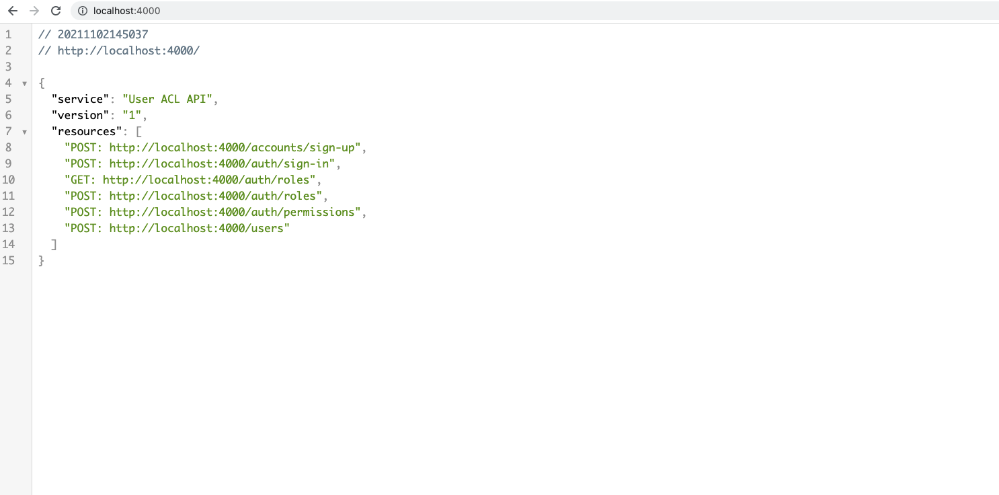

<h1 align="center">User ACL API - Access-control list</h1>

  <a href="#-padrões-e-princípios">Padrões e Princípios</a>&nbsp;&nbsp;&nbsp;|&nbsp;&nbsp;&nbsp;
  <a href="#-tecnologias">Tecnologias</a>&nbsp;&nbsp;&nbsp;|&nbsp;&nbsp;&nbsp;
  <a href="#-como-executar">Como executar</a>&nbsp;&nbsp;&nbsp;|&nbsp;&nbsp;&nbsp;
  <a href="#-licença">Licença</a>

  

## ✨ Padrões e Princípios

Esse projeto foi desenvolvido com os seguintes Pattern e Design:
- Clean architecture
- Controller
- Service
- Repository
- IoC

Princípios SOLID:
- Dependency inversion principle
- Single-responsibility principle

## ✨ Tecnologias
Esse projeto foi desenvolvido com as seguintes tecnologias:

- [TypeScript](https://www.typescriptlang.org/)
- [Express](https://expressjs.com/pt-br/)
- [Prisma](https://www.prisma.io/)
- [JSON Web Token](https://jwt.io/)
- [BCryptJS](https://www.npmjs.com/package/bcryptjs/)
- [Celebrate](https://github.com/arb/celebrate/)

## 🚀 Como executar

> Obs.: Nesse projeto temos autenticação via OAuth com o GitHub e autenticação normal usuário e senha
- Clone o repositório e acesse a pasta;
- Faça uma copia do arquivo `.env.example` para `.env` e preencha com as suas credenciais do GitHub;
- Instale as dependências com `yarn`;
- Executa as migrations com `yarn prisma migrate dev`;
- Executa as seeds com `yarn prisma db seed`;
- Inicie o servidor com `yarn dev`;

A aplicação pode ser acessada em [`localhost:4000`](http://localhost:4000/).
Você vai visualizar a home da API listando os endpoints

## 📄 Licença

Esse projeto está sob a licença MIT. Veja o arquivo [LICENSE](LICENSE) para mais detalhes.

---

Feito com ♥ by @joaokvalho 👋🏻 &nbsp;
